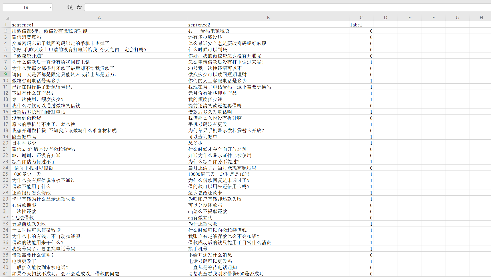
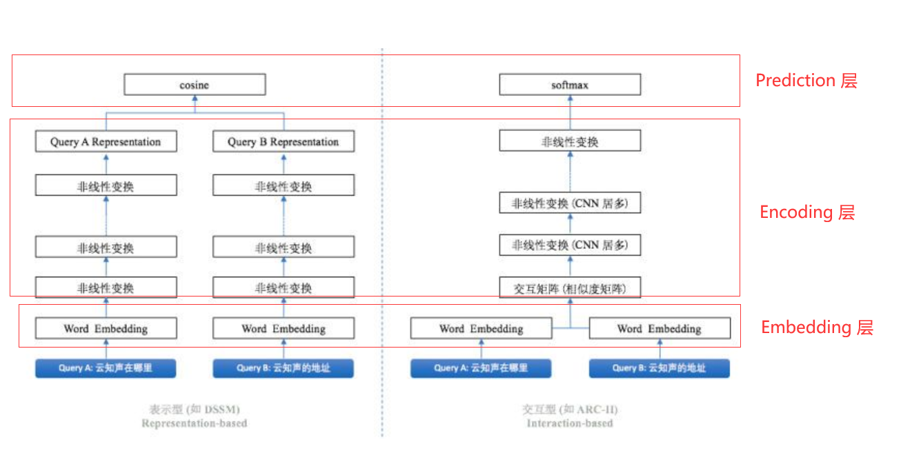
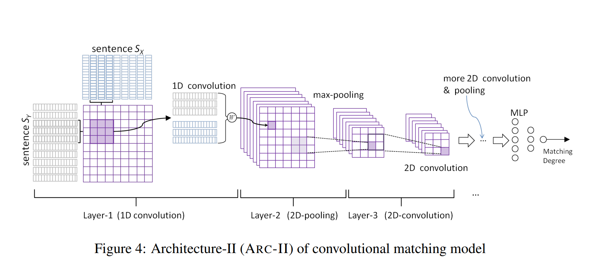
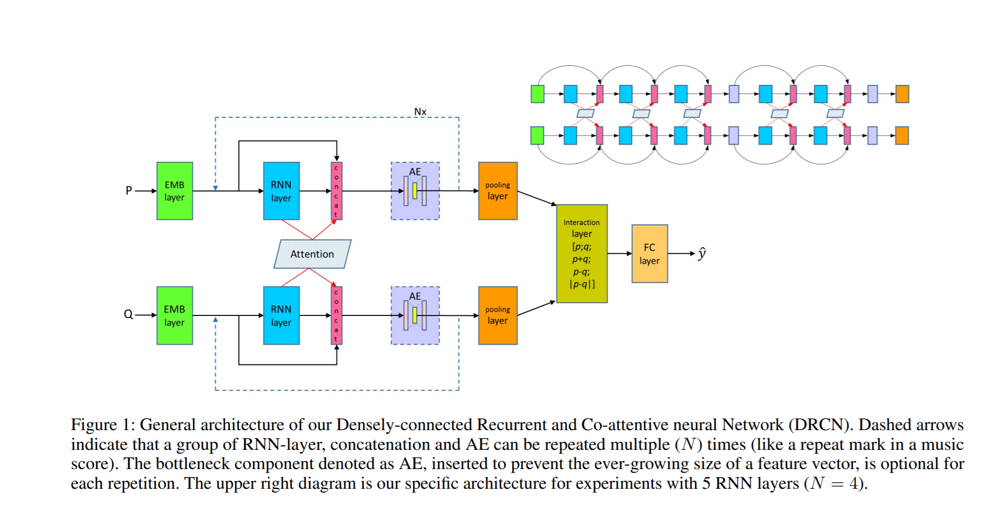
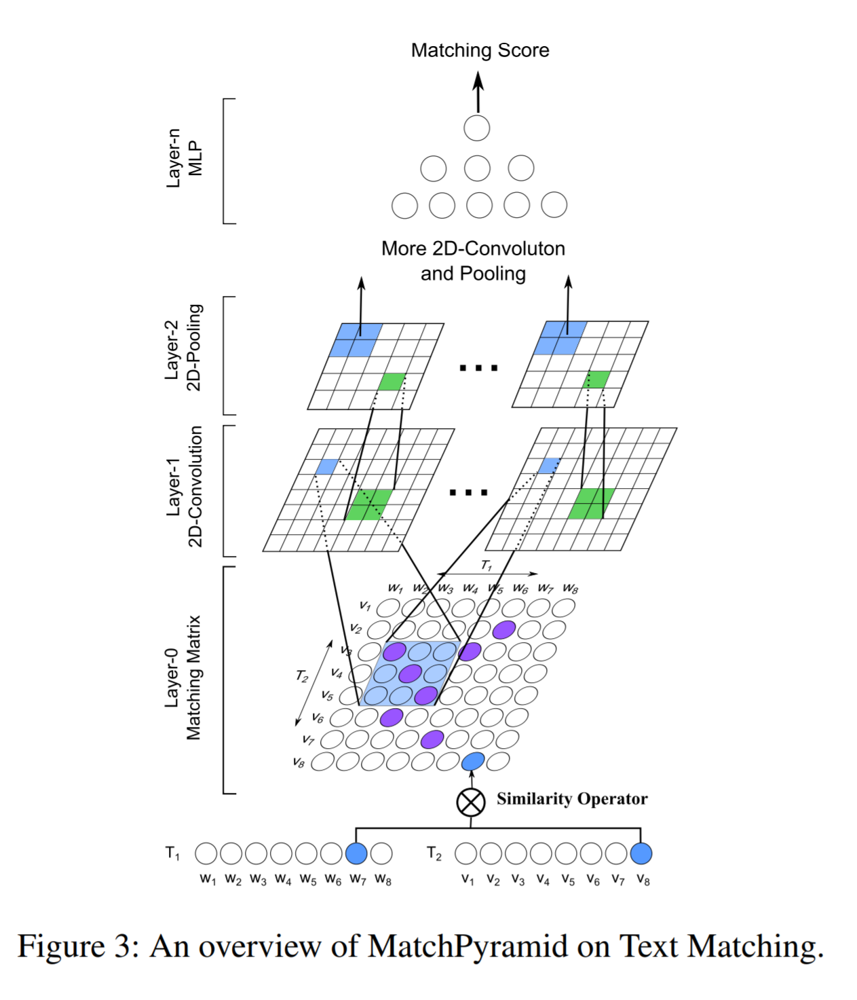

# Deep text matching

## 1、前言

Github 上面有很多文本匹配项目，本项目工作主要借鉴了 [MatchZoo ](https://github.com/NTMC-Community/MatchZoo)和 [text matching](https://github.com/terrifyzhao/text_matching) ，模型的代码风格来自前者。另外模型是使用 keras 深度学习框架进行复现的，主要也是使用的前者的复现代码，只是增加了个别模型的复现，也去除了一些我觉得不太重要的模型；另外，由于本项目只是实验层面探索，所以将 matchzoo 源码中一些和模型无关的很多代码进行了删减，同时对部分模型的结构进行了细微的调整，没有完全遵从论文里的设置。

我使用这些模型在2018年蚂蚁金服的文本匹配竞赛数据集（数据集来自text matching 上传，因此数据的预处理代码也使用的该项目的代码）上进行了一些实验，另外我借鉴了 [bert4keras ](https://github.com/bojone/bert4keras)项目的代码测试了几个 bert 系列模型（bert 及其变体）。由于训练集、验证集、测试集中的正负样本比例都是1:1，因此我使用了准确率这一评价指标来衡量了这些模型的性能，结果如下：

| 模型          | 发表年份 | batchsize | epoch | dev acc | test acc | 训练参数量  |
| ------------- | -------- | --------- | ----- | ------- | -------- | ----------- |
| cdssm         | 2014     | 64        | 5     | 0.7816  | 0.7644   | 470,684     |
| arc-ii        | 2014     | 64        | 3     | 0.7814  | 0.7734   | 47,362      |
| match_pyramid | 2016     | 64        | 1     | 0.7109  | 0.6887   | 3,650,882   |
| mvlstm        | 2015     | 64        | 6     | 0.8393  | 0.7964   | 107,778     |
| bimpm         | 2017     | 64        | 4     | 0.8171  | 0.8040   | 103,426     |
| drcn          | 2018     | 64        | 5     | 0.8080  | 0.7940   | 3,430,050   |
| esim          | 2017     | 64        | 7     | 0.8235  | 0.8149   | 839,810     |
| bert-base     | 2018     | 8         | 4     | 0.8393  | 0.8300   | 177,854,978 |
| albert-base   | 2020     | 32        | 3     | 0.8362  | 0.8301   | 24,302,594  |
| albert-large  | 2020     | 16        | 3     | 0.8527  | 0.8302   | 35,811,330  |
| raberta       | 2019     | 16        | 3     | 0.8523  | 0.8438   | 102,269,186 |

上表中bert 系列模型的 batchsize 是在我的电脑上能设置的最大size ，epoch表示得到最佳 dev acc 的轮数，dev acc 表示验证集上最好的准确率，test acc 表示在验证集上得到最好效果的模型在测试集上的准确率。

## 2、如何运行项目中模型

### 环境准备

```
tensorflow >= 1.14 (1.x版本)
keras >= 2.3.1
```

### 运行

- 运行一般深度神经网络模型

```python
#运行cdssm模型
#进入text_match文件夹路劲
python word2vec_static.py #训练词向量，仅在第一次运行本项目的模型时需要
python train.py cdssm
```

- 运行 bert 系列模型

```python
#安装bert4keras 库
pip install bert4keras
# 自行准备预训练模型的权重文件和配置文件
# 进入bert_model文件夹
# 修改函数 build_transformer_model 中 ‘model’参数
python bert_similarly.py
```

### 使用自己的数据训练

- 将自己的数据集处理成 header 为 sentence1，sentence2，label 三个字段的csv文件,如下图所示：



将数据分为 train.cav，dev.csv ，test.csv 放入 `./input` 文件夹中。

- 自己重写数据预处理脚本

### 设置参数

在`train.py`脚本里的相应位置设置相应模型的参数。

## 3、实验结果分析

毫无疑问 bert 系列模型的效果最好，由于我的电脑不允许我使用较大的batchsize进行训练，因此上文表格中报道的准确率不是最佳准确率，如果加大batchsize 应该能提升效果的；另外使用 rnn 做encode 的模型效果明显好于使用cnn 做 encode 的模型。

文本匹配模型一般分为表示型和交互型模型，为了下文方便描述，我将文本匹配模型的框架分为三个层，分别是 Embedding 层，Encoding 层（在交互型模型里，该层还包含匹配层）, Prediction 层如下所示：



### Encoding 层参数共享与不共享

由于模型需要对输入的左右两个句子进行建模，因此需要编码器分别对两个句子进行编码，我们可以选择是否共享左右编码器的参数，下面两段代码分别表示不共享与共享的写法。

```python
rep_left = keras.layers.Bidirectional(keras.layers.LSTM(
    self._params['lstm_units'],
    return_sequences=True,
    dropout=self._params['dropout_rate']
))(embed_left)
rep_right = keras.layers.Bidirectional(keras.layers.LSTM(
    self._params['lstm_units'],
    return_sequences=True,
    dropout=self._params['dropout_rate']
))(embed_right)
```

```python
bilstm = keras.layers.Bidirectional(keras.layers.LSTM(
    self._params['lstm_units'],
    return_sequences=True,
    dropout=self._params['dropout_rate']
))
rep_left = bilstm(embed_left)
rep_right = bilstm(embed_right)
```

不共享参数的情况其实就是分别初始化两个双向LSTM网络，然后分别对左右两个句子进行编码；而共享参数是只初始化一个双向LSTM网络，然后左右句子都使用它来编码。在计算文本相似度这个任务时，从实验中发现共享参数的编码对模型更有帮助，比如 mvlstm和 bimpm 两个模型共享Encoding 层参数比不共享参数准确率要高 7-8个百分点，这两个模型都是使用 rnn 网络做编码器的；而使用cnn 网络做编码器的 arcii 模型共享参数后比不共享参数准确率高2个百分点左右。

### 深度神经网络模型并不是网络层数越多效果越好

在深度学习领域其实有个经验，就是只要把网络做深效果就会更好，这也许有一定道理，但是面对不同数据，我们应该多尝试。在 arcii 模型中 3 个 cnn block（如下图的 more 2D convolution & pooling 结构）比 2 个 cnn block的模型效果要差一些（0.7734 -> 0.7684）。



产生这个结果的原因可能是所用数据集的句子基本是短句子，语句结构也不复杂的缘故。其实可以看到准确率差的也不多，但是使用 rnn 做 encode的模型在增加深度后效果将会差的更多。

如下图所示的 drcn 模型，原文中使用 4 个 Nx 模块，每个Nx 包含 5 层 LSTM，总共20 层 LSTM的网络，但是在我的实验中我发现在每个 Nx 里面只能用两层LSTM，且只能用 1个 Nx，如果再多效果反而会不好。



另外该模型虽然花里花俏的，但是效果并没有更朴素 bimpm 和 mvlstm 模型要好。也许是我用了 BatchNormalization 做层归一化的缘故（MatchZoo 中使用的 Dropout），但是不用 BN 的话训练时将会造成梯度爆炸。

## match_pyramid 和 arcii 模型

这两个模型都是使用2D convolution 做编码器提取特征的，但是为什么match_pyramid 效果这么差呢？将match_pyramid模型的结构和arcii对比一下：



可以看到，match_pyramid直接用左右两个句子的embedding进行匹配交互，然后用 2D convolution 提取特征，这显然匹配层的好坏直接取决于 embedding的好坏；而arcii 首先使用了一层 1D convolution 对embedding进行编码，再进行匹配计算的。所以其实 match_pyramid 模型等于就是 arcii 模型的阉割版（少一层关键的 1D convolution）。

## 4、后记

本项目可以作文入门自然语言处理的练手项目，了解了这些模型基本就对文本匹配这一任务就不再陌生了，你将熟悉各种编码器的使用，熟悉各种匹配交互的方式，由此你可以在实际项目中对这些模型进行魔改以适应你的数据。

现在 bert 系列模型大行其道，很多人一上手就使用 bert 进行 fineturn ，这本没有错，只要你机器够好就行。但是训练这些模型毕竟很吃机器性能，上线后推理速度也很慢，如果bert 的效果不比普通深度模型好一大截的话，那其实还不如用普通模型上线；因此花些时间了解一下这些非bert模型也是很有必要的。

欢迎大家使用本项目模型在其他开源数据上进行试验、调参，然后可以在 GitHub issues 里面和大家报告你的试验成果。你可以报告使用的模型名称、所使用的的开源数据集、设置的模型参数以及咋以数据集上的评测结果，或者其他信息。

## 参考项目

MatchZoo ：https://github.com/NTMC-Community/MatchZoo

text matching：https://github.com/terrifyzhao/text_matching

bert4keras：https://github.com/bojone/bert4keras
